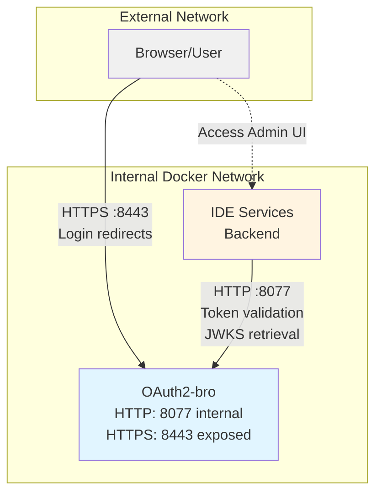

# Dual HTTP/HTTPS Setup for JetBrains IDE Services

## Problem Statement

When running OAuth2-bro with HTTPS, it's challenging for backend services like JetBrains IDE Services to connect securely:
- **HTTPS between services** is recommended for security but complicated to configure
- Certificate management adds operational complexity
- Backend services need to validate certificates or configure trust stores
- In containerized environments, certificate distribution becomes even more complex

## Solution: Dual HTTP/HTTPS Operation

OAuth2-bro supports running **both HTTP and HTTPS simultaneously** on different ports:
- **HTTPS port (8443)** - For external access (browsers, external clients)
- **HTTP port (8077)** - For internal service-to-service communication (NOT exposed externally)

This approach provides security where it matters (browser connections) while simplifying internal service communication.

## Architecture Diagram



## How It Works

### 1. **Browser Login Flow (HTTPS)**
- User accesses IDE Services Admin UI
- IDE Services redirects browser to OAuth2-bro login URL using **HTTPS** (port 8443)
- Browser communicates securely with OAuth2-bro over HTTPS
- OAuth2-bro authenticates user based on IP address
- Browser redirects back to IDE Services with authorization code

### 2. **Backend Token Exchange (HTTP)**
- IDE Services backend exchanges authorization code for access token
- This happens server-to-server using **HTTP** (port 8077)
- No certificate configuration needed
- HTTP port is not exposed externally - only accessible within Docker network

### 3. **Backend Token Validation (HTTP)**
- IDE Services validates JWT tokens by fetching JWKS from OAuth2-bro
- Uses **HTTP** (port 8077) for internal communication
- No certificate complexity

## Configuration

### OAuth2-bro Environment Variables

```bash
# Network binding
OAUTH2_BRO_BIND_HOST=0.0.0.0

# HTTP port - INTERNAL ONLY, not exposed externally
OAUTH2_BRO_HTTP_PORT=8077

# HTTPS port - EXPOSED externally for browsers
OAUTH2_BRO_HTTPS_PORT=8443
OAUTH2_BRO_HTTPS_CERT_FILE=/certs/server-cert.pem
OAUTH2_BRO_HTTPS_CERT_KEY_FILE=/certs/server-key.pem
```

### Docker Compose Port Mapping

```yaml
services:
  oauth2-bro:
    environment:
      - OAUTH2_BRO_HTTP_PORT=8077    # Internal only
      - OAUTH2_BRO_HTTPS_PORT=8443   # External
      - OAUTH2_BRO_HTTPS_CERT_FILE=/certs/cert.pem
      - OAUTH2_BRO_HTTPS_CERT_KEY_FILE=/certs/key.pem
    ports:
      - "8443:8443"  # ONLY expose HTTPS port
      # HTTP port 8077 is NOT in ports: section - stays internal
```

**Important:** The HTTP port (8077) is **not** listed in the `ports:` section, which means it's only accessible to other containers in the same Docker network, not from the host machine or external networks.

### IDE Services Configuration

Create a configuration file (e.g., `ide-services-config.yaml`):

```yaml
tbe:
  auth:
    # Browser redirects use HTTPS (external)
    login-url: 'https://oauth2-bro:8443/login'

    # Backend calls use HTTP (internal, not exposed)
    token-url: 'http://oauth2-bro:8077/token'
    jwt-certs-url: 'http://oauth2-bro:8077/jwks'

    root-admin-emails:
      - 'admin@company.com'
    root-admin-subjects:
      - 'admin'
```

**Key Point:** Notice that:
- `login-url` uses **HTTPS** - this URL is sent to browsers for redirection
- `token-url` and `jwt-certs-url` use **HTTP** - these are called by IDE Services backend

## Security Considerations

### ✅ This Approach is Secure When:

1. **HTTP port is not exposed externally**
   - Only accessible within trusted Docker network or VPC
   - Not listed in Docker `ports:` section
   - Firewall rules prevent external access

2. **Deployed in trusted internal network**
   - Behind corporate firewall
   - In isolated VPC/VNET
   - Only accessible to authorized services

3. **External access uses HTTPS**
   - All browser traffic encrypted
   - Only HTTPS port exposed to internet
   - Certificates properly configured

### ⚠️ Important Security Notes

- **Never expose the HTTP port to untrusted networks** (internet, public cloud)
- HTTP port should only be accessible to services that need it (IDE Services backend)
- In production, use proper certificates from trusted CA (Let's Encrypt, enterprise CA)
- Consider using service mesh (Istio, Linkerd) for mTLS if your environment supports it

## Benefits

### ✅ Advantages of Dual HTTP/HTTPS Setup

1. **Simplified Operations**
   - No certificate configuration for IDE Services backend
   - No trust store management for internal services
   - Reduces certificate renewal complexity

2. **Security Where It Matters**
   - External traffic (browsers) uses HTTPS
   - Internal traffic stays within trusted network
   - Follows principle of defense in depth

3. **Flexibility**
   - Easy to add more backend services
   - Works in various deployment environments
   - Compatible with existing security models

4. **Performance**
   - HTTP reduces overhead for high-frequency internal calls
   - No TLS handshake for service-to-service communication

## Production Deployment Example

### Kubernetes Deployment

```yaml
apiVersion: v1
kind: Service
metadata:
  name: oauth2-bro
spec:
  selector:
    app: oauth2-bro
  ports:
    # HTTPS port - exposed externally via Ingress
    - name: https
      port: 8443
      targetPort: 8443
    # HTTP port - ClusterIP only, internal access
    - name: http-internal
      port: 8077
      targetPort: 8077
  type: ClusterIP  # Not LoadBalancer - keeps internal

---
apiVersion: networking.k8s.io/v1
kind: Ingress
metadata:
  name: oauth2-bro-ingress
spec:
  rules:
    - host: oauth2-bro.company.com
      http:
        paths:
          - path: /
            pathType: Prefix
            backend:
              service:
                name: oauth2-bro
                port:
                  number: 8443  # Only HTTPS exposed via Ingress
```

In this setup:
- Ingress only exposes HTTPS port (8443)
- HTTP port (8077) remains internal ClusterIP
- IDE Services pods access OAuth2-bro via `http://oauth2-bro:8077`

## Try It Locally

Run the complete demo:

```bash
cd integration-test
./run-ide-services-https.sh
```

This script:
1. Generates self-signed certificates automatically
2. Starts OAuth2-bro in dual HTTP/HTTPS mode
3. Configures IDE Services with proper URLs
4. Exposes only HTTPS port (8443) to host machine

Access:
- IDE Services Admin UI: http://localhost:8085
- OAuth2-bro HTTPS (external): https://localhost:8443
- OAuth2-bro HTTP (internal): Not accessible from host - as intended!

## Troubleshooting

### Browser Cannot Connect to Login URL

**Symptom:** Browser shows "Connection refused" when redirected to login

**Solution:** Ensure HTTPS port is exposed in Docker compose:
```yaml
ports:
  - "8443:8443"  # Must be present
```

### IDE Services Cannot Validate Tokens

**Symptom:** "Failed to fetch JWKS" or token validation errors

**Solution:**
- Check that services are in the same Docker network
- Verify `jwt-certs-url` uses HTTP and internal hostname: `http://oauth2-bro:8077/jwks`
- Ensure OAuth2-bro container is running

### Certificate Warnings in Browser

**Symptom:** Browser shows "Your connection is not private"

**Solution:**
- For testing: Accept the self-signed certificate
- For production: Use proper CA-signed certificates
- For development: Add certificate to system trust store

## Alternative Approaches

If dual HTTP/HTTPS doesn't fit your security model, consider:

1. **Full HTTPS Everywhere**
   - Configure certificates in all services
   - Use service mesh for automatic mTLS
   - More complex but highest security

2. **Ingress/LoadBalancer TLS Termination**
   - Terminate TLS at ingress/load balancer
   - Backend uses HTTP within trusted network
   - Common in cloud deployments

3. **VPN or Service Mesh**
   - Use Istio/Linkerd for automatic mTLS
   - VPN for network-level encryption
   - More infrastructure complexity

The dual HTTP/HTTPS approach strikes a balance between security and operational simplicity.
